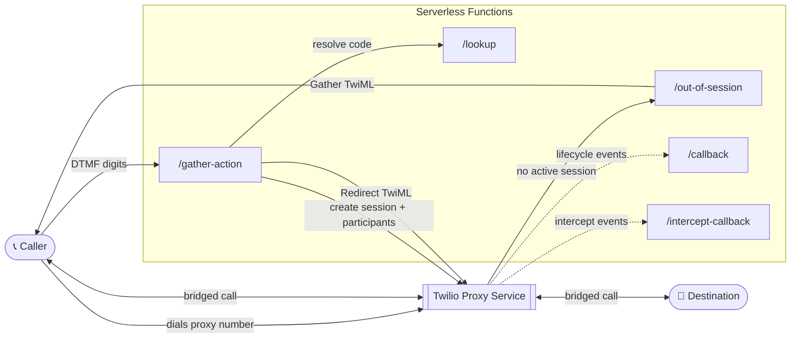
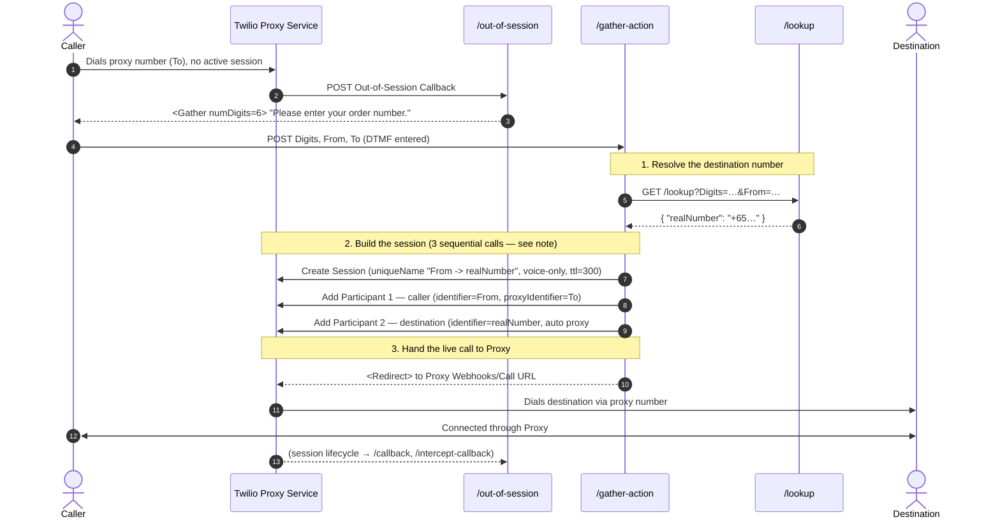
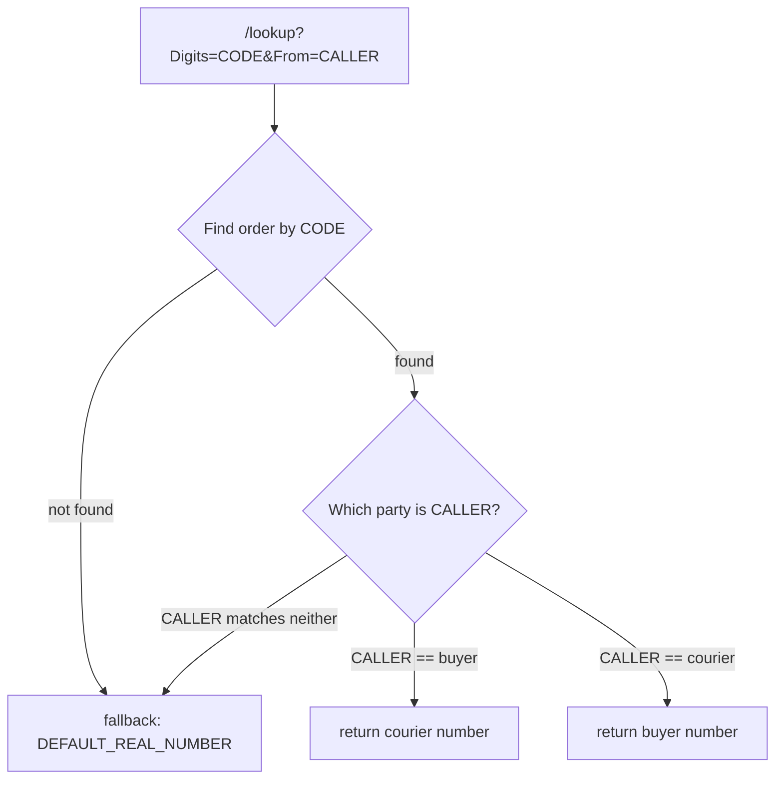

# twilio-proxy-single-participant-workflow

Twilio Serverless (TypeScript) functions implementing a **Twilio Proxy out-of-session voice workflow**.

A caller dials a Proxy number that has no active session for them. Instead of failing, the call is intercepted, the caller is prompted for a 6-digit code, the code is resolved to a real destination number, a Proxy Session is created on the fly, and the live call is redirected into that session — connecting the caller to the destination through the proxy number so neither party sees the other's real number.

---

## Table of contents

- [Architecture at a glance](#architecture-at-a-glance)
- [Endpoints](#endpoints)
- [The Flow (how it works)](#the-flow-how-it-works)
  - [Sequence diagram](#sequence-diagram)
  - [Step-by-step](#step-by-step)
  - [Participant identities explained](#participant-identities-explained)
  - [Why this can't be a single API call](#why-this-cant-be-a-single-api-call)
  - [The redirect trick](#the-redirect-trick)
- [How the lookup should work (bidirectional)](#how-the-lookup-should-work-bidirectional)
- [Environment variables](#environment-variables)
- [Setup](#setup)
- [Run locally](#run-locally)
- [Test & typecheck](#test--typecheck)
- [Deploy](#deploy)
- [Project structure](#project-structure)

---

## Architecture at a glance



Everything runs on the Twilio Serverless (Functions) runtime. `/lookup` stands in for a real number-resolution REST API — swap it for your own service in production.

---

## Endpoints

| Route | Method | Configure as | Purpose |
|-------|--------|--------------|---------|
| `/out-of-session` | POST | Proxy Service **Out-of-Session Callback URL** (Voice) | Entry point when a call hits a proxy number with no session. Returns a `<Gather>` for the code. |
| `/gather-action` | POST | Target of the `<Gather action>` (set automatically) | Receives the DTMF digits, resolves the number, creates the session, and redirects the call into Proxy. |
| `/lookup` | GET | Called internally by `/gather-action` | Mock REST API: maps a 6-digit code (+ caller number) to a destination number. |
| `/callback` | POST | Proxy Service **Callback URL** | Receives Proxy session lifecycle events. Logs and returns `200`. |
| `/intercept-callback` | POST | Proxy Service **Intercept Callback URL** | Receives Proxy intercept events. Logs and returns `200`. |

---

## The Flow (how it works)

This is the core of the project. The goal: take a caller who dials a proxy
number with **no pre-existing Proxy Session**, and dynamically stand up a
session that connects them to the right destination — all within the single
live call.

### Sequence diagram



### Step-by-step

1. **Inbound call, no session.** A caller dials one of the phone numbers
   attached to the Proxy Service. Because there is no active Proxy Session
   involving that caller, Proxy fires its **Out-of-Session Callback** to
   `/out-of-session`.

2. **Prompt for a code.** `/out-of-session` returns TwiML with a `<Gather>`
   that collects **6 DTMF digits** and posts them to `/gather-action`. The
   action URL is built at runtime from `SERVICE_BASE_URL` (or the deployed
   `DOMAIN_NAME`), so it works identically on localhost, ngrok, and a
   deployed domain.

   ```xml
   <Response>
     <Gather input="dtmf" numDigits="6" method="POST" action="{baseUrl}/gather-action">
       <Say>Please enter your order number.</Say>
     </Gather>
   </Response>
   ```

3. **Digits arrive.** The caller keys in the code. Twilio posts `Digits`,
   `From` (the caller's real number), and `To` (the proxy number they dialed)
   to `/gather-action`. If any of these are missing, the handler says a short
   apology and hangs up — it never creates a partial session.

4. **Resolve the destination.** `/gather-action` calls `/lookup` with the
   digits and caller number. `/lookup` uses `resolveRealNumber()` to look the
   code up in `LOOKUP_MAP`, falling back to `DEFAULT_REAL_NUMBER` when the
   code is unknown or the map is malformed. It responds with
   `{ "realNumber": "+65…" }`.

5. **Create the session.** `/gather-action` creates a new Proxy Session, then
   adds the two participants in **sequential** calls — **the caller first**
   (see [Why this can't be a single API call](#why-this-cant-be-a-single-api-call)).
   The session is created with:
   - `uniqueName` = `"<caller> -> <destination>"` (the actual numbers, e.g.
     `+6590100209 -> +6590492680`), so sessions are identifiable in the console;
   - `mode: 'voice-only'`;
   - `ttl: 300` (5 minutes) so the session — and the proxy numbers it holds —
     free themselves 5 minutes after the last interaction.

   This is the "single-participant workflow" in action: the session is
   assembled programmatically rather than pre-existing.

6. **Redirect into Proxy.** Finally, `/gather-action` returns a `<Redirect>`
   pointing the *still-live* call at the Proxy Service's `Webhooks/Call`
   endpoint. Proxy takes over, dials the destination through the proxy number,
   and bridges the two parties. Neither side sees the other's real number.

7. **Lifecycle events.** As the session progresses, Proxy posts events to
   `/callback` and `/intercept-callback`. These handlers log the payload and
   always return `200` with an empty JSON body — they never throw, so they
   can't disrupt the session.

### Participant identities explained

The two participants are what wire the call together:

| Participant | `identifier` | `proxyIdentifier` | Meaning |
|-------------|--------------|-------------------|---------|
| **1 — the caller** | `From` (caller's real number) | `To` (the proxy number they dialed) | Binds the caller to the specific proxy number, so the redirect matches them back into this session. |
| **2 — the destination** | `realNumber` (resolved by `/lookup`) | *(none — auto-assigned)* | Proxy picks a *free* proxy number to reach the destination. |

Because Participant 1 pins `proxyIdentifier = To`, the caller stays on the
exact number they originally dialed — the redirect feels seamless.

### Why this can't be a single API call

It's tempting to collapse the session + two participants into one call:

```ts
// ❌ Looks efficient, but breaks this flow:
sessions.create({ mode: 'voice-only', participants: [
  { Identifier: From, ProxyIdentifier: To },  // caller pins the dialed number
  { Identifier: realNumber },                  // destination auto-assigns
]});
```

The caller's `proxyIdentifier` **must** be `To` (the number they dialed) or the
redirect in step 6 can't match them back into the session. The destination must
get a **different** proxy number so the two legs are distinct.

In a single atomic `create`, Proxy resolves the destination's auto-assigned
number **without yet knowing the caller has claimed `To`** — so it hands the
destination the *same* number. The result is a collision:

```
caller       From        -> To            (e.g. +6560443611)
destination  realNumber   -> To            (e.g. +6560443611)  ← same number!
```

This was verified empirically against a live service (with a 2-number pool):
both participants received the same proxy number regardless of the service's
`numberSelectionBehavior` (`prefer-sticky` **and** `avoid-sticky`). When the
caller and destination are in the same country (`geoMatchLevel = country`) and
the number pool is small, the collision drops one participant — the caller ends
up missing, Proxy treats the redirected call as out-of-session again, and the
caller is re-prompted for the code in an endless loop.

**The fix is ordering.** Creating the **caller first** actually reserves `To`,
so when the destination is added next, that number is unavailable and Proxy is
forced to pick a different free number:

```
caller       From        -> To            (+6560443611, reserved first)
destination  realNumber   -> (auto)        (+6560356067, the remaining number)
```

Sequencing requires the caller's participant to exist *before* the destination
is resolved, which a single call cannot express. Hence: **session create →
add caller → add destination**, three sequential calls.

> The only way to keep it to one call would be to pass the destination an
> explicit `ProxyIdentifier` of a known-free number — but discovering a free
> number means querying the pool first (another API call, and race-prone). So
> the sequential approach is both simpler and more robust.

### The redirect trick

The redirect URL is constructed from account/service context:

```
https://webhooks.twilio.com/v1/Accounts/{ACCOUNT_SID}/Proxy/{PROXY_SERVICE_SID}/Webhooks/Call
```

Redirecting the live call to this URL is what moves an ordinary inbound PSTN
call *into* the freshly created Proxy Session. That's the mechanism that turns
an out-of-session call into a proxied, connected call.

---

## How the lookup should work (bidirectional)

A code (an "order") connects **two parties** — for example a **buyer** and a
**courier**. The workflow must connect them **regardless of who calls first**:

- Buyer dials the proxy number, enters the code → should reach the **courier**.
- Courier dials the proxy number, enters the code → should reach the **buyer**.

So `/lookup` must not map a code to a single fixed number. It must resolve the
**other party** relative to whoever is calling. Two inputs make this possible,
and `/gather-action` already sends both:

- `Digits` — the entered code, identifying the order (the pair of parties).
- `From` — the caller's real number, identifying **which** party is calling.

The rule: *look up the order by `Digits`, find the caller within it by `From`,
and return the counterparty's number.*

### Direction resolution



| Caller (`From`) is… | Return (`realNumber`) |
|---------------------|-----------------------|
| the **buyer**       | the **courier**'s number |
| the **courier**     | the **buyer**'s number   |
| neither / unknown   | `DEFAULT_REAL_NUMBER` (or reject) |

### Data model

Instead of `code → number`, store each order as a **pair** so either direction
resolves. A production lookup would back this with a database keyed on the
code; the mock can express it as JSON:

```jsonc
{
  "123456": { "buyer": "+6590492680", "courier": "+6581234567" },
  "654321": { "buyer": "+6599990000", "courier": "+6588887777" }
}
```

Resolution pseudocode:

```ts
const order = orders[digits];
if (!order) return DEFAULT_REAL_NUMBER;          // unknown code
if (from === order.buyer)   return order.courier; // buyer → courier
if (from === order.courier) return order.buyer;   // courier → buyer
return DEFAULT_REAL_NUMBER;                        // caller not part of order
```

### Why this is symmetric with Proxy

The rest of the flow already works both ways without changes: `/gather-action`
adds the caller (`From`) as Participant 1 and the resolved counterparty as
Participant 2, then redirects into Proxy. Because the lookup returns the
counterparty relative to the caller, the exact same code path connects
buyer→courier and courier→buyer — only the `/lookup` resolution differs by
direction.

> **Current state:** the shipped `/lookup` (`resolveRealNumber`) is a
> simplified **one-directional** mock — it maps `code → number` using
> `LOOKUP_MAP` and ignores `From`. To support the buyer↔courier use case,
> replace it with the pair-based, `From`-aware resolution above (and update
> `LOOKUP_MAP` to the paired structure or point `/lookup` at your real
> service).

---

## Environment variables

Copy `.env.example` to `.env` and fill in real values. `.env` is gitignored.

| Variable | Required | Description |
|----------|----------|-------------|
| `ACCOUNT_SID` | Yes | Twilio Account SID. Also injected at runtime as `context.ACCOUNT_SID`. |
| `AUTH_TOKEN` | For local dev | Account auth token. Needed by the local `twilio-run` dev server so `getTwilioClient()` can authenticate. On deployed Functions, Twilio injects credentials automatically. |
| `PROXY_SERVICE_SID` | Yes | Proxy Service SID (`KS…`) used for session creation and the redirect URL. |
| `LOOKUP_MAP` | Yes | JSON map of `"6-digit code": "+destinationNumber"`, e.g. `{"123456":"+6590492680"}`. |
| `DEFAULT_REAL_NUMBER` | Yes | Fallback destination (E.164) when the entered code isn't in `LOOKUP_MAP`. |
| `SERVICE_BASE_URL` | Optional | Absolute base URL of this service. When empty, it's derived from `context.DOMAIN_NAME` (`https` for `*.twil.io`, `http` for `localhost`). Set this when fronting the dev server with a tunnel (e.g. `https://your.ngrok.io`). |

---

## Setup

```bash
npm install
cp .env.example .env   # then fill in real values
```

If you use the Twilio CLI, select the target account before deploying:

```bash
twilio profiles:use <your-profile>
```

---

## Run locally

```bash
npm start
```

This builds (`tsc` + copy assets) and starts `twilio-run` on **port 3000**.
Functions are served at `http://localhost:3000/<route>`.

To receive real Twilio webhooks, expose the server with a public tunnel and
set `SERVICE_BASE_URL` to the public URL so generated action/redirect URLs are
publicly reachable:

```bash
# .env
SERVICE_BASE_URL=https://your-subdomain.ngrok.io
```

Then point the Proxy Service webhook URLs (see [Endpoints](#endpoints)) at that
public base.

## Test & typecheck

```bash
npm test         # jest unit tests
npm run typecheck   # tsc --noEmit
```

## Deploy

```bash
npm run deploy
```

After deploying, set the three Proxy Service webhook URLs
(`/out-of-session`, `/callback`, `/intercept-callback`) to the deployed
function URLs. `/gather-action` and `/lookup` are wired up automatically at
runtime.

---

## Project structure

```
src/
  functions/
    out-of-session.ts     # entry point: Gather for the 6-digit code
    gather-action.ts      # resolve number, create session, redirect into Proxy
    lookup.ts             # mock number-lookup REST API
    callback.ts           # Proxy lifecycle events (log + 200)
    intercept-callback.ts # Proxy intercept events (log + 200)
  assets/
    helpers.private.ts    # getBaseUrl(), resolveRealNumber() (runtime: /helpers.js)
tests/                    # jest unit tests, one per function + helpers
```

> `*.private.ts` assets are not publicly served; they're loaded inside
> functions via `Runtime.getAssets()['/helpers.js'].path`.
