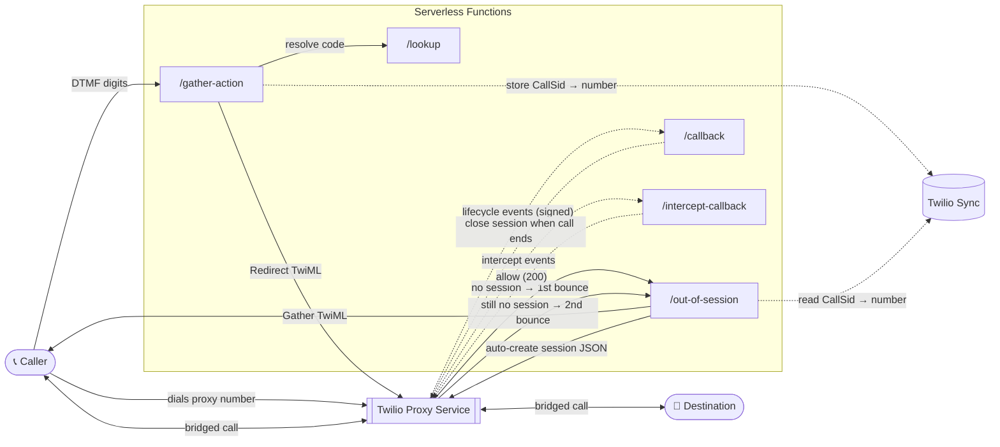
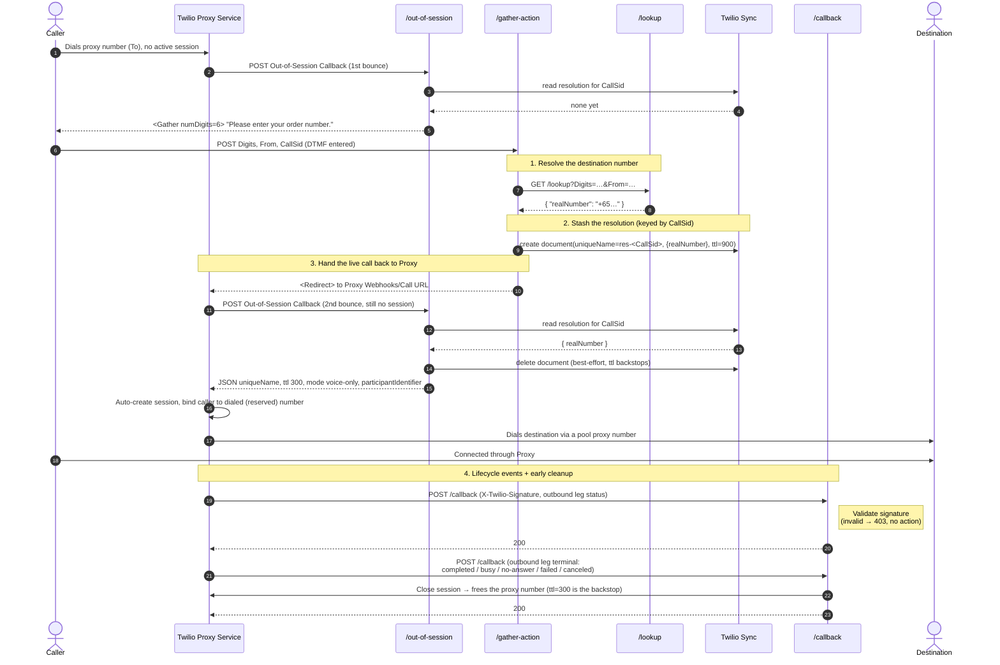
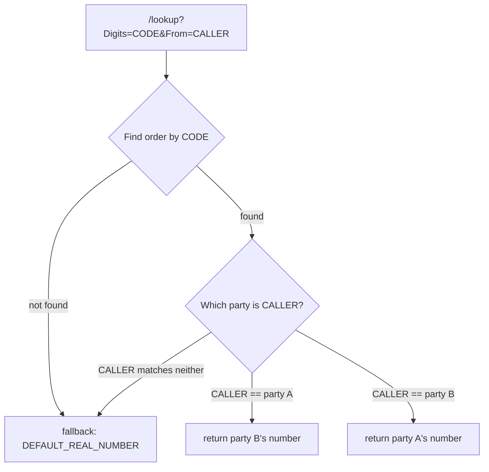

# twilio-proxy-single-participant-workflow

Twilio Serverless (TypeScript) functions implementing a **Twilio Proxy out-of-session voice workflow**.

A caller dials a Proxy number that has no active session for them. Instead of failing, the call is intercepted, the caller is prompted for a 6-digit code, and the code is resolved to a real destination number. That number is stashed in **Twilio Sync** and the live call is redirected back into Proxy, which fires its Out-of-Session Callback a **second** time — this time answered with Proxy's **auto-create-session** JSON. Proxy stands up the session itself, binds the caller to the exact (reserved) number they dialed, and bridges them to the destination through the proxy number so neither party sees the other's real number.

---

## Table of contents

- [Architecture at a glance](#architecture-at-a-glance)
  - [Entry point: the reserved Proxy number](#entry-point-the-reserved-proxy-number)
- [Endpoints](#endpoints)
- [The Flow (how it works)](#the-flow-how-it-works)
  - [Sequence diagram](#sequence-diagram)
  - [Step-by-step](#step-by-step)
  - [Why Proxy auto-creates the session (not us)](#why-proxy-auto-creates-the-session-not-us)
  - [Why the resolution travels through Twilio Sync](#why-the-resolution-travels-through-twilio-sync)
  - [The redirect trick](#the-redirect-trick)
- [How the lookup works (bidirectional)](#how-the-lookup-works-bidirectional)
- [Data stores & schema](#data-stores--schema)
- [Environment variables](#environment-variables)
- [Setup](#setup)
- [Run locally](#run-locally)
- [Test & typecheck](#test--typecheck)
- [Deploy](#deploy)
- [Project structure](#project-structure)

---

## Architecture at a glance



Everything runs on the Twilio Serverless (Functions) runtime. `/lookup` reads the order→parties data from a Twilio Sync Map — swap it for your own service in production (see [Data stores & schema](#data-stores--schema)).

### Entry point: the reserved Proxy number

The **front door** of the whole flow is a **reserved** phone number on the Proxy
Service. The caller dials it, and — because there's no active session for them —
Proxy fires its Out-of-Session Callback to `/out-of-session`.

Why *reserved* matters: a reserved Proxy number is **never auto-assigned** to a
participant. That's exactly what makes the auto-create step reliable — when
Proxy creates the session from the auto-create JSON, it binds the caller to the
very number they dialed (nothing else could have grabbed it), so the caller's
live PSTN leg always matches the session. A non-reserved entry number could be
handed to some other participant and the match would fail.

Set the number's **Voice** configuration to the Proxy Service (or add it to the
service's number pool as a reserved number) so inbound calls trigger the
Out-of-Session Callback.

---

## Endpoints

| Route | Method | Configure as | Purpose |
|-------|--------|--------------|---------|
| `/out-of-session` | POST | Proxy Service **Out-of-Session Callback URL** (Voice) | Entry point when a call hits a proxy number with no session. On the **1st** bounce (no stored resolution) returns a `<Gather>` for the code. On the **2nd** bounce (after `/gather-action` has stashed the resolution) returns Proxy's **auto-create-session JSON**, so Proxy builds the session, binds the caller to the dialed number, and bridges the call. |
| `/gather-action` | POST | Target of the `<Gather action>` (set automatically) | Receives the DTMF digits, resolves the destination number, **stores it in Twilio Sync keyed by `CallSid`**, and redirects the call back into Proxy (which triggers the 2nd out-of-session bounce). It no longer creates the session itself. |
| `/lookup` | GET | Called internally by `/gather-action` | Number-resolution API: reads the **Sync `lookup` Map** to map a 6-digit code (+ caller number) to the counterparty's destination number. |
| `/callback` | POST | Proxy Service **Callback URL** | Receives Proxy session lifecycle events. **Validates the Twilio signature**, logs the event, and **closes the session** once the outbound leg reaches a terminal state (freeing the proxy number early). Returns `200`. |
| `/intercept-callback` | POST | Proxy Service **Intercept Callback URL** | Receives Proxy intercept events. Logs and returns `200`. |

---

## The Flow (how it works)

This is the core of the project. The goal: take a caller who dials a proxy
number with **no pre-existing Proxy Session**, and dynamically stand up a
session that connects them to the right destination — all within the single
live call.

### Sequence diagram



### Step-by-step

1. **Inbound call, no session.** A caller dials one of the phone numbers
   attached to the Proxy Service. Because there is no active Proxy Session
   involving that caller, Proxy fires its **Out-of-Session Callback** to
   `/out-of-session`.

2. **Prompt for a code.** `/out-of-session` returns TwiML with a `<Gather>`
   that collects **6 DTMF digits** and posts them to `/gather-action`. The
   action URL is built at runtime from `SERVICE_BASE_URL` (or the deployed
   `DOMAIN_NAME`), so it works identically on localhost, ngrok, and a
   deployed domain.

   ```xml
   <Response>
     <Gather input="dtmf" numDigits="6" method="POST" action="{baseUrl}/gather-action">
       <Say>Please enter your order number.</Say>
     </Gather>
   </Response>
   ```

3. **Digits arrive.** The caller keys in the code. Twilio posts `Digits`,
   `From` (the caller's real number), and `CallSid` (the call identifier, used
   as the Sync key) to `/gather-action`. If any of these are missing, the
   handler says a short apology and hangs up.

4. **Resolve the destination.** `/gather-action` calls `/lookup` with the
   digits and caller number. `/lookup` reads the **Sync `lookup` Map** and uses
   `resolveCounterparty()` to return the *other* party for that code, falling
   back to `DEFAULT_REAL_NUMBER` when the code is unknown or the caller isn't in
   the pair. It responds with `{ "realNumber": "+E164" }`.

5. **Stash the resolution.** `/gather-action` does **not** create the session.
   It writes a **Twilio Sync Document** (`uniqueName = res-<CallSid>`, `data =
   { realNumber }`, `ttl: 900`) so the resolved number survives until Proxy
   asks for it again. This is necessary because the Out-of-Session Callback
   payload never contains the entered `Digits` — only the second bounce can
   turn the resolution into a session, and it needs somewhere to read the
   number from. `CallSid` is the join key because it's stable across the 1st
   bounce, `/gather-action`, and the 2nd bounce. It's prefixed with `res-`
   because Sync **rejects a `uniqueName` that matches the Twilio SID pattern**
   (`[A-Z]{2}[a-f0-9]{32}`) — a raw `CallSid` (`CA…`) matches it and errors with
   `54302 Invalid unique name`, so `save`/`get`/`delete` all key through the
   same `res-<CallSid>` helper.

6. **Redirect back into Proxy.** `/gather-action` returns a `<Redirect>`
   pointing the *still-live* call at the Proxy Service's `Webhooks/Call`
   endpoint. Because no session matches yet, Proxy fires its Out-of-Session
   Callback **again** — the second bounce.

7. **Auto-create on the second bounce.** This time `/out-of-session` finds a
   stored resolution for the `CallSid`, so instead of a `<Gather>` it returns
   Proxy's **auto-create-session JSON**:

   ```json
   {
     "uniqueName": "<caller> -> <destination> @ <ISO timestamp>",
     "ttl": 300,
     "mode": "voice-only",
     "participantIdentifier": "<destination>"
   }
   ```

   Proxy then creates the session itself, **automatically adds the caller as a
   participant bound to the exact number they dialed** (the reserved `To`),
   adds `participantIdentifier` as the destination on a free pool number, and
   bridges the two parties. The stored Sync Document is deleted (best-effort;
   its TTL is the backstop). Neither side sees the other's real number.
   - `uniqueName` carries an ISO timestamp because a Proxy `uniqueName` is
     **never released** (not even after the session closes); a static name
     would let a pair create only one session ever and fail later calls with
     error `80603`.
   - `ttl: 300` (5 minutes) frees the session — and the proxy numbers it holds
     — five minutes after the last interaction.
   - The response must be a genuine **JSON object with
     `Content-Type: application/json`** (the 1st bounce, by contrast, is TwiML
     with `application/xml`). Do **not** hand the runtime a pre-stringified
     body: `response.setBody(JSON.stringify(obj))` double-encodes it into a
     quoted string (`"{\"uniqueName\":…}"`), so Proxy parses it as TwiML and
     fails with error `12100` ("Content is not allowed in prolog") — the call
     never connects. Pass the object itself and let the runtime serialize once.

8. **Lifecycle events & early cleanup.** As the session progresses, Proxy
   posts events to `/callback` and `/intercept-callback`.
   `/intercept-callback` just logs and returns `200` (allow). `/callback`:

   - **Verifies the `X-Twilio-Signature`** on every request. Because it now
     performs a destructive action (closing a session), the public URL must be
     authenticated — a forged POST with a guessed session SID could otherwise
     tear down a live call. Invalid/missing signature → `403`, no action.
   - **Closes the session** as soon as the outbound (destination) leg reaches a
     terminal state — `completed`, `busy`, `no-answer`, `failed`, or
     `canceled`. Closing releases the held proxy number back to the pool
     *immediately* instead of waiting out the TTL, which matters when the number
     pool is small. The `ttl: 300` set at creation remains the backstop if a
     callback is missed or the session was already closed.
   - Always returns `200` after a successful signature check and never throws,
     so cleanup failures (e.g. an already-closed session) can't disrupt Proxy.

### Why Proxy auto-creates the session (not us)

The caller dials a **reserved** proxy number. A reserved number is never
auto-assigned to a participant — Proxy will only put a participant on it if you
name it explicitly. That's exactly the binding we need: the caller's live PSTN
leg is physically on the number they dialed, so the caller's participant *must*
sit on that same number, or the redirect can't match them back into a session.

Letting `/gather-action` create the session itself makes this fragile: adding
the caller without a `proxyIdentifier` lets Proxy auto-assign a *different* pool
number than the one they dialed, and the redirect then fails to match — the
call falls back to out-of-session and loops. (Observed live: the caller was
auto-assigned a pool number other than the reserved one they dialed, so every
redirect bounced straight back to `/out-of-session`.)

Proxy's **auto-create-session** response sidesteps all of this. When
`/out-of-session` answers a bounce with the JSON below, Proxy creates the
session **and binds the caller to the exact number they dialed for you** — no
manual participant wiring, no chance of the caller landing on the wrong number:

```json
{
  "uniqueName": "<caller> -> <destination> @ <ISO timestamp>",
  "ttl": 300,
  "mode": "voice-only",
  "participantIdentifier": "<destination>"
}
```

You only specify the *other* party (`participantIdentifier`); Proxy owns the
caller side.

### Why the resolution travels through Twilio Sync

The catch: that JSON needs `participantIdentifier` (the resolved destination),
but the Out-of-Session Callback payload only ever contains `From`, `To`, and
`CallSid` — **never the entered `Digits`**. Only `/gather-action` sees the
digits and can resolve the number. So the resolution has to be handed to the
*second* out-of-session bounce out-of-band:

```
1st bounce   /out-of-session   Sync has nothing for CallSid   → <Gather>
             /gather-action    resolve digits → Sync.write(CallSid → number)
2nd bounce   /out-of-session   Sync has number for CallSid     → auto-create JSON
```

`CallSid` is the join key because it stays identical across the 1st bounce,
`/gather-action`, and the 2nd bounce. We use a **Twilio Sync Document** per call
(`uniqueName = res-<CallSid>`, `ttl: 900`) — it's a managed, strongly-consistent
store that works both locally and when deployed. (A file-based store like
`lowdb` would work on the local dev server but not on deployed Twilio Functions,
whose filesystem isn't shared or writable across invocations.) The `res-` prefix
is required because Sync rejects a SID-shaped `uniqueName` and a raw `CallSid`
matches that pattern.

### The redirect trick

The redirect URL is constructed from account/service context:

```
https://webhooks.twilio.com/v1/Accounts/{ACCOUNT_SID}/Proxy/{PROXY_SERVICE_SID}/Webhooks/Call
```

Redirecting the live call to this URL hands the still-live PSTN call back to
Proxy. Since no session matches it yet, Proxy fires the Out-of-Session Callback
a second time — and *that* bounce (now armed with the Sync resolution) returns
the auto-create JSON that stands up the session and connects the call.

---

## How the lookup works (bidirectional)

A code (an "order") connects **two parties** — for example a **buyer** and a
**courier**. The workflow connects them **regardless of who calls first**:

- Party A dials the proxy number, enters the code → reaches **party B**.
- Party B dials the proxy number, enters the code → reaches **party A**.

So `/lookup` does not map a code to a single fixed number. It resolves the
**other party** relative to whoever is calling, using the two inputs
`/gather-action` sends:

- `Digits` — the entered code, identifying the order (the pair of parties).
- `From` — the caller's real number, identifying **which** party is calling.

The rule: *look up the order by `Digits`, find the caller within it by `From`,
and return the counterparty's number.*

### Direction resolution



| Caller (`From`) is… | Return (`realNumber`) |
|---------------------|-----------------------|
| **party A**         | **party B**'s number |
| **party B**         | **party A**'s number |
| neither / unknown   | `DEFAULT_REAL_NUMBER` |

### Data model

The mapping lives in the **Twilio Sync `lookup` Map** (see
[Data stores & schema](#data-stores--schema)), one item per code:

```jsonc
// Sync Map "lookup" — item key = the 6-digit code
"123456" -> { "parties": ["+partyA", "+partyB"] }   // bidirectional pair
"654321" -> { "number":  "+dest" }                  // legacy one-directional
```

The order of the two numbers in a pair doesn't matter — resolution returns
whichever one is *not* the caller. This is implemented by
`resolveCounterparty()` (`src/assets/helpers.private.ts`):

```ts
// entry = the Sync Map item's data
const [a, b] = entry.parties;            // bidirectional pair
if (from === a) return b;                // party A → party B
if (from === b) return a;                // party B → party A
// caller not in the pair (or code not found) → fall through to default
return DEFAULT_REAL_NUMBER;
```

**Seeding:** the demo data lives in the `LOOKUP_MAP` env var; `npm run
seed:lookup` (`scripts/seed-lookup.js`) reads it and upserts each entry into the
Sync Map. `/lookup` never reads `LOOKUP_MAP` at runtime — only the Sync Map.

> **Backward compatible:** a legacy `{ "number": "+dest" }` item is still
> honoured — it returns that number regardless of the caller. Prefer the
> `parties` pair for new entries so the flow works in both directions.

### Why this is symmetric with Proxy

The rest of the flow works both ways without changes: `/gather-action` stashes
the resolved counterparty as `participantIdentifier`, and Proxy auto-creates the
session with the caller (`From`) bound to the dialed number. Because the lookup
returns the counterparty relative to the caller, the exact same code path
connects A→B and B→A — only the `/lookup` resolution differs by direction.

In production, the Sync `lookup` Map can be replaced by any database/service
keyed on the code that applies the same "return the other party" rule (see
[Data stores & schema](#data-stores--schema)).

---

## Data stores & schema

The workflow keeps **all** its state in **Twilio Sync** — two structures in one
Sync Service (`SYNC_SERVICE_SID`):

| Purpose | Sync resource | Key | Data schema | Lifetime |
|---------|---------------|-----|-------------|----------|
| Per-call handoff of the resolved number from `/gather-action` to the 2nd `/out-of-session` bounce | **Document** | `uniqueName = res-<CallSid>` | `{ "realNumber": "+E164" }` | `ttl: 900s` (auto-expires) |
| Order → parties lookup data (read by `/lookup`) | **Map** `lookup` | item key = 6-digit code | `{ "parties": ["+E164A", "+E164B"] }` or legacy `{ "number": "+E164" }` | permanent (managed data) |

> The resolution Document is keyed by `res-<CallSid>`, not the raw `CallSid`:
> Sync rejects a `uniqueName` that matches the Twilio SID pattern
> (`[A-Z]{2}[a-f0-9]{32}`), which a `CallSid` does. The `res-` prefix is applied
> in one helper (`resolutionKey()`) shared by `save`/`get`/`delete`.

### Twilio Sync is swappable for any database

Sync is just a managed key-value store here — nothing in the design depends on
it. To swap in Redis, DynamoDB, Postgres, or anything else, reimplement the four
helper functions in `src/assets/helpers.private.ts` against your store, keeping
the **same schema** above:

- `saveResolution(callSid, realNumber)` — write `CallSid → { realNumber }` with a TTL.
- `getResolution(callSid)` — read it back (return `null` if absent/expired).
- `deleteResolution(callSid)` — best-effort delete (TTL is the real backstop).
- `getLookupEntry(digits)` — read the `lookup` collection by code, returning
  `{ parties }` / `{ number }` (or `null`).

The resolution store needs **TTL + get/put/delete by key**; the lookup store
needs a **keyed collection**. Any datastore offering those works.

### Twilio Functions is swappable for your own stack

The five handlers in `src/functions/` are plain
request → (TwiML | JSON) logic — Twilio Functions is only the **host**. You can
run the exact same logic on Express, AWS Lambda, Cloud Run, etc., as long as the
endpoints Proxy (and the `<Gather>`) call keep the same contract:

| Endpoint | Consumes | Returns |
|----------|----------|---------|
| `/out-of-session` | Proxy Out-of-Session Callback (`From`, `To`, `CallSid`, …) | `<Gather>` TwiML **or** auto-create JSON |
| `/gather-action` | `<Gather>` POST (`Digits`, `From`, `CallSid`) | `<Redirect>` TwiML |
| `/lookup` | `Digits`, `From` | `{ "realNumber": "+E164" }` |
| `/callback` | Proxy lifecycle event (signed) | `200` |
| `/intercept-callback` | Proxy intercept event | `200` |

Off Twilio Functions you'd replace the runtime bits (`Twilio.Response`,
`Runtime.getAssets()`, `context.getTwilioClient()`) with your framework's
equivalents and a standard Twilio SDK client, and provide `X-Twilio-Signature`
validation on `/callback` yourself.

---

## Environment variables

Copy `.env.example` to `.env` and fill in real values. `.env` is gitignored.

| Variable | Required | Description |
|----------|----------|-------------|
| `ACCOUNT_SID` | Yes | Twilio Account SID. Also injected at runtime as `context.ACCOUNT_SID`. |
| `AUTH_TOKEN` | Yes | Account auth token. Needed by the local `twilio-run` dev server so `getTwilioClient()` can authenticate, **and by `/callback` to validate the `X-Twilio-Signature`** (both locally and when deployed — set it as a Function environment variable on deploy). |
| `PROXY_SERVICE_SID` | Yes | Proxy Service SID (`KS…`) used to build the redirect URL. Proxy itself creates the session (via the auto-create response), so this is only for the `Webhooks/Call` redirect. |
| `SYNC_SERVICE_SID` | Optional | Twilio Sync Service SID (`IS…`) backing the `CallSid → destination` handoff between `/gather-action` and the 2nd `/out-of-session` bounce. When empty, the account's **default** Sync service (alias `"default"`) is used, so no setup is needed. |
| `LOOKUP_MAP` | Seed only | **Seed data**, not read at runtime. JSON map of `"6-digit code"` → **two-party pair** `["+partyA","+partyB"]`, e.g. `{"123456":["+15551112222","+15551230000"]}`. `npm run seed:lookup` loads it into the Sync `lookup` Map, which is what `/lookup` actually reads. A legacy string value (`"code":"+number"`) is also supported. See [How the lookup works](#how-the-lookup-works-bidirectional). |
| `DEFAULT_REAL_NUMBER` | Yes | Fallback destination (E.164) when the code is unknown or the caller isn't part of the pair. |
| `SERVICE_BASE_URL` | Optional | Absolute base URL of this service. When empty, it's derived from `context.DOMAIN_NAME` (`https` for `*.twil.io`, `http` for `localhost`). Set this when fronting the dev server with a tunnel (e.g. `https://your.ngrok.io`). |

---

## Setup

```bash
npm install
cp .env.example .env   # then fill in real values
npm run seed:lookup    # load LOOKUP_MAP into the Sync `lookup` Map
```

`npm run seed:lookup` reads `LOOKUP_MAP` from `.env` and upserts each code into
the Sync Map that `/lookup` reads. Re-run it whenever the seed data changes;
it's idempotent.

If you use the Twilio CLI, select the target account before deploying:

```bash
twilio profiles:use <your-profile>
```

---

## Run locally

```bash
npm start
```

This builds (`tsc` + copy assets) and starts `twilio-run` on **port 3000**.
Functions are served at `http://localhost:3000/<route>`.

To receive real Twilio webhooks, expose the server with a public tunnel and
set `SERVICE_BASE_URL` to the public URL so generated action/redirect URLs are
publicly reachable:

```bash
# .env
SERVICE_BASE_URL=https://your-subdomain.ngrok.io
```

Then point the Proxy Service webhook URLs (see [Endpoints](#endpoints)) at that
public base.

## Test & typecheck

```bash
npm test         # jest unit tests
npm run typecheck   # tsc --noEmit
```

## Deploy

```bash
npm run deploy
```

After deploying, set the three Proxy Service webhook URLs
(`/out-of-session`, `/callback`, `/intercept-callback`) to the deployed
function URLs. `/gather-action` and `/lookup` are wired up automatically at
runtime.

---

## Project structure

```
src/
  functions/
    out-of-session.ts     # 1st bounce: Gather for the code; 2nd bounce: auto-create JSON
    gather-action.ts      # resolve number, stash in Sync (by CallSid), redirect into Proxy
    lookup.ts             # number-lookup: reads the Sync `lookup` Map
    callback.ts           # Proxy lifecycle events (validate signature, close session, 200)
    intercept-callback.ts # Proxy intercept events (log + 200)
  assets/
    helpers.private.ts    # getBaseUrl(), resolveCounterparty(), Sync store + lookup helpers (runtime: /helpers.js)
scripts/
  seed-lookup.js          # seed the Sync `lookup` Map from LOOKUP_MAP (npm run seed:lookup)
tests/                    # jest unit tests, one per function + helpers
```

> `*.private.ts` assets are not publicly served; they're loaded inside
> functions via `Runtime.getAssets()['/helpers.js'].path`.
